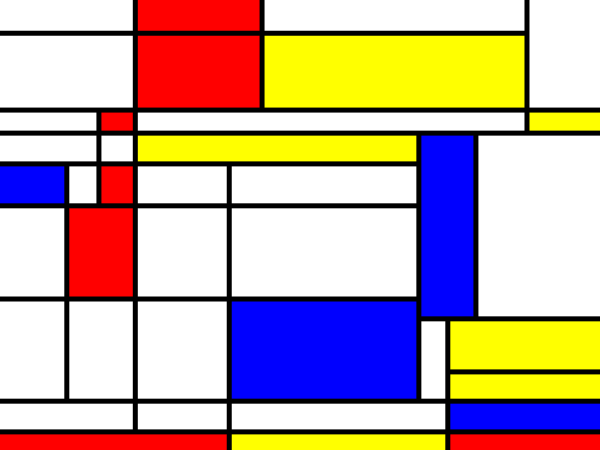

# mondrian
Computer-generated Mondrian art

Source: https://github.com/xnx/mondrian

This repository is not synced with that. I have not yet gotten valid output from these--I suspect an older Python version than 3 is required.

See http://scipython.com/blog/computer-generated-mondrian-art-1/ for more information.

There are two versions, illustrated by the scripts `example1.py` and `example2.py`, which import from the files `mondrian.py` and `mondrian2.py` respectively. The first gives better-looking "orthogonal" images, the second can produce images with lines that cross at random angles by setting `orthogonal=False` as in `example2.py`.

The examples can be run directly as, e.g.
python example1.py
and generate an SVG file that can be opened and viewed in a web browser.

